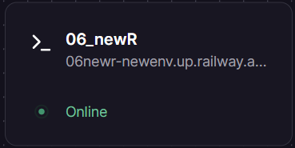
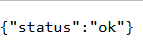
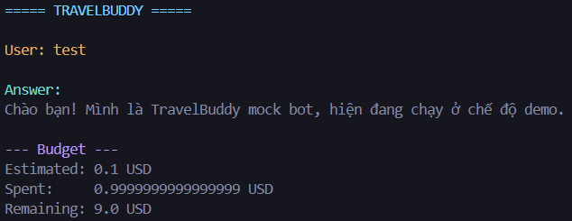

# Deployment Information

## Public URL
https://06newr-newenv.up.railway.app

## Platform
Railway 

## Test Commands

### Health Check
```bash
curl https://06newr-newenv.up.railway.app
Expected: {"status": "ok"}
```

### API Test (with authentication)
```bash
curl.exe -s -X POST "https://06newr-newenv.up.railway.app/chat" `
  -H "Authorization: Bearer travelbuddy-secret" `
  -H "Content-Type: application/json" `
  -d '{\"user_id\":\"test\",\"message\":\"Hello\",\"estimated_cost_usd\":0.1}'

```

## Environment Variables Set
- API_BEARER_TOKEN=travelbuddy-secret
- MONTHLY_BUDGET_USD=10
- RATE_LIMIT_PER_MINUTE=20
- USE_MOCK_LLM=true

## Screenshots
- 
- 
- 
