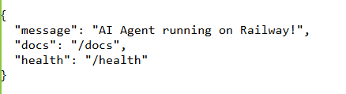

# Day 12 Lab - Mission Answers

## Part 1: Localhost vs Production

### Exercise 1.1: Anti-patterns found
1. API Key hardcode ngay trong code 
2. Không có config management
3. Print thay vì proper logging
4. Không có health check endpoint
5. Port cố định — không đọc từ environment

### Exercise 1.3: Comparison table
| Feature | Basic | Advanced | Tại sao quan trọng? |
|---------|-------|----------|---------------------|
| Config | Hardcode | Env vars | Hardcode chỉ hợp demo local. Env vars giúp đổi host, debug,API Key theo từng môi trường, không phải sửa code khi deploy. |
| Health check | Không có | Có /health | Giúp kiểm tra service còn sống và sẵn sàng hoạt động |
| Logging | print() | JSON | Print() chỉ tiện debug tay. JSON dễ dàng theo dõi lỗi, tìm kiếm log, tích hợp monitoring. |
| Shutdown | Đột ngột | Graceful | Khi app tắt đột ngột, request dang dở, connection, file handle, DB session có thể bị lỗi. Graceful shutdown giúp đóng tài nguyên sạch sẽ và giảm mất dữ liệu. |

## Part 2: Docker

### Exercise 2.1: Dockerfile questions
1. Base image: Base image là nền dùng để build container. Nó cung cấp sẵn hệ điều hành và môi trường runtime. Trong Dockerfile này, python:3.11 giúp container có sẵn Python để chạy ứng dụng mà không cần cài đặt lại.
2. Working directory: Working directory là thư mục mặc định bên trong container, nơi các lệnh như COPY, RUN, CMD sẽ được thực thi. Việc dùng WORKDIR /app giúp code được tổ chức gọn gàng và không cần ghi đường dẫn dài.
3. COPY requirements.txt: Việc copy requirements.txt trước giúp tận dụng Docker layer cache. Nếu dependencies không thay đổi, Docker sẽ không cài lại packages ở lần build sau, giúp giảm thời gian build khi chỉ thay đổi code.
4. CMD vs ENTRYPOINT:
- `CMD` dùng để định nghĩa lệnh mặc định khi container chạy, có thể bị override khi chạy container.
- `ENTRYPOINT` định nghĩa lệnh cố định, ít bị thay đổi, thường dùng khi container hoạt động như một tool hoặc service.

### Exercise 2.3: Image size comparison
- Develop: [1.66] GB
- Production: [236] MB
- Difference: [85.78]%

###  Exercise 2.4: Docker Compose stack
> Services nào được start? Chúng communicate thế nào?
- Hiện tại Redis và Qdrant đã chạy thành công, nhưng Agent và Nginx chưa được khởi động nên hệ thống chưa thể xử lý request hoàn chỉnh.
- Trong hệ thống Docker Compose, các service giao tiếp với nhau thông qua network nội bộ bằng tên service (service name). 

## Part 3: Cloud Deployment

### Exercise 3.1: Railway deployment
- URL: https://railway01-production-d933.up.railway.app
- Screenshot: 

## Part 4: API Security

### Exercise 4.1-4.3: Test results
#### Exercise 4.1
"question":"hello","answer":"Agent đang hoạt động tốt! (mock response) Hỏi thêm câu hỏi đi nhé."

#### Exercise 4.2
"answer":"Explain JWT Tôi là AI agent được deploy lên cloud. Câu hỏi của bạn đã được nhận."

#### Exercise 4.3
- Hệ thống dùng thuật toán Sliding Window Counter. 
- User thường bị giới hạn 10 request mỗi 60 giây, còn admin là 100 request mỗi 60 giây. 
- Admin không được bypass hoàn toàn mà được áp dụng rate limiter riêng với limit cao hơn.
- Khi gọi liên tục 20 lần, gọi thành công 10 lần đầu, 10 lần sau (từ 11 đến 20) gặp lỗi 429 - rate limit

### Exercise 4.4: Cost guard implementation
- Mục tiêu của hàm `check_budget` là kiểm tra user còn đủ ngân sáhc hay không trước khi thực hiện phép request.
- Mỗi lần có request:
    - Lấy tổng chi phí hiện tại của user
    - Cộng với chi phí ước tính của request mới
    - Nếu vượt $10 → chặn (return False)
    - Nếu chưa vượt → cho phép và cập nhật lại tổng chi phí

## Part 5: Scaling & Reliability

### Exercise 5.1-5.5: Implementation notes
#### Exercise 5.1
- `/health `: {"status":"ok"}
- `/ready `: {"detail":"Not Found"}

#### Exercise 5.2
- Requests vẫn hoàn thành:
`{"answer":"Agent đang hoạt động tốt! (mock response) Hỏi thêm câu hỏi đi nhé."}`

=> Khi shutdown, app không dừng ngay lập tức mà vẫn xử lý xong request đang chạy → không bị mất request giữa chừng.

#### Exercise 5.3
- Agent vẫn nhớ history 
- Trước: `{"answer":"Tôi là AI agent được deploy lên cloud. Câu hỏi của bạn đã được nhận."}`
- Sau: `{"answer":"Agent đang hoạt động tốt! (mock response) Hỏi thêm câu hỏi đi nhé."}`

#### Exercise 5.4
- Load balancing giúp phân tán request qua nhiều instances thay vì dồn vào một instance. Khi scale lên 3 agents, Nginx sẽ route request ngẫu nhiên hoặc theo round-robin.

- Khi test gửi nhiều request liên tiếp, logs cho thấy các request được xử lý bởi nhiều container → chứng tỏ load balancing hoạt động đúng.

#### Exercise 5.5
- Sau khi kill instance, request vẫn hoạt động bình thường
→ chứng tỏ state không phụ thuộc vào instance cụ thể (đã chuyển ra Redis hoặc external storage)
